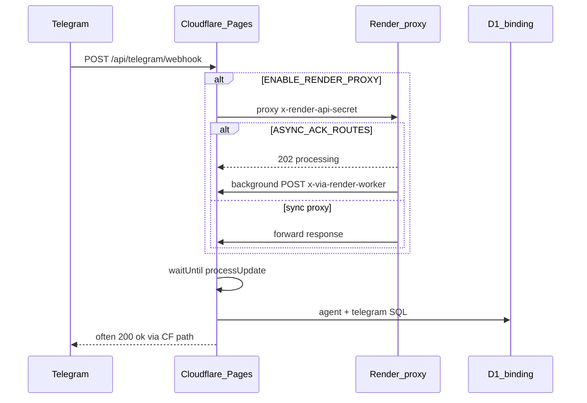

# Telegram → native Render — Phase 0 discovery notes

Phase 0 is **documentation only** (no runtime changes). Phase 1 adds the D1 adapter and `createRenderEnv()`; Phases 2–5 mount Telegram on Render and cut over the webhook.

Master plan: [TELEGRAM_NATIVE_RENDER_AGENT_PROMPT.md](./TELEGRAM_NATIVE_RENDER_AGENT_PROMPT.md)

---

## Current architecture (split proxy)

Telegram updates are **acked on Cloudflare** and processed in `executionCtx.waitUntil`. Render today is a **reverse proxy** back to Pages — it does not run `runAgentRouted`.



| Component | File | Role |
|-----------|------|------|
| Telegram handler | `src/routes/channels/telegram.ts` | `POST /webhook` → `{ ok: true }` + `waitUntil(processUpdate)`; 10 min timeout around `runAgentRouted` |
| CF → Render proxy | `src/index.tsx` | `/api/telegram` in `RENDER_PROXY_ROUTES`; long routes default **310s** |
| Render worker | `src/render/server.ts` | Auth + reverse proxy to `LEGACY_API_BASE_URL`; optional **202** async ack — **no agent** |
| D1 client (Phase 1) | `src/render/d1.ts`, `d1-adapter.ts` | libsql HTTP to D1; adapter not wired in `server.ts` until Phase 3 |
| Webhook registration | `src/frontend/settings.ts` | `getTelegramWebhookUrl()` → Render backend (`API_BASE_URL`), not CF origin |
| Render deploy | `render.yaml` | `RENDER_API_SECRET`, `LEGACY_API_BASE_URL`, `ASYNC_ACK_ROUTES`, D1/R2 tokens |

---

## Env checklist

### Cloudflare Pages / Worker bindings (Telegram → agent path)

| Binding | Purpose |
|---------|---------|
| `DB` | users, credentials, threads, conversations, memory, error_log, notifications, briefings, cron |
| `GOOGLE_CLIENT_ID` / `GOOGLE_CLIENT_SECRET` | OAuth tools (`create_doc`, Gmail, etc.) |
| `GOOGLE_API_KEY` / `GOOGLE_CSE_ID` | Search / Places |
| `DOCUMENTS_BUCKET` | Document upload tool (R2) |
| `AI` / `VECTORIZE` | Embeddings + `search_library` (no-op when absent) |

**D1 `credentials` (decrypted with `pin_hash`):** `telegram_bot_token`, `llm_slot_*`, `openai`, `browser_use_api_key`, Google refresh tokens.

### Render today (proxy only)

| Variable | Purpose |
|----------|---------|
| `RENDER_API_SECRET` | Shared secret with CF gateway |
| `LEGACY_API_BASE_URL` | CF Pages API base (e.g. `https://karna-5xs.pages.dev`) |
| `ASYNC_ACK_ROUTES` | Optional **202** for chat + telegram proxy hops |
| `CLOUDFLARE_*` (D1/R2) | Declared in `render.yaml`; **unwired** until Phase 3+ |

### Render native Telegram (Phase 3 — implemented)

| Item | Status |
|------|--------|
| `POST /api/telegram/webhook` on Render | Native handler in `src/render/server.ts`; no `LEGACY_API_BASE_URL` forward |
| Auth | Public path (no `x-render-api-secret`); bot token validated via D1 in processor |
| D1 | `createRenderEnv()` → `processTelegramUpdate` |
| `GOOGLE_*` | Set on Render (mirror Pages) |
| `DOCUMENTS_BUCKET` | R2 S3 shim when `CLOUDFLARE_R2_*` vars set (`src/render/r2-bucket.ts`) |
| `AI` / `VECTORIZE` | **Not on Render** — CF Worker bindings only; `search_library` / embeddings need CF or future proxy |

**Manual dev test (after `npm run render:worker` with env):**

```bash
curl -sS -X POST http://localhost:10000/api/telegram/webhook \
  -H 'Content-Type: application/json' \
  -d '{"update_id":1,"message":{"message_id":1,"chat":{"id":123},"from":{"id":123},"text":"/start"}}'
# Expect: {"ok":true}
```

Phase 4 (Settings UI): webhook registration uses the Render backend URL (`API_BASE_URL` / `getTelegramWebhookUrl()`), not `window.location.origin`. Re-register via Settings → Telegram after deploy.

### Render D1 HTTP (Phase 1+)

| Variable | Required | Notes |
|----------|----------|-------|
| `CLOUDFLARE_ACCOUNT_ID` | Yes | D1 libsql host segment |
| `CLOUDFLARE_D1_DATABASE_ID` | Yes | D1 libsql host segment |
| `CLOUDFLARE_D1_API_TOKEN` | Yes | `authToken` for `@libsql/client` |

**Libsql URL (not REST v4):**

`https://{CLOUDFLARE_ACCOUNT_ID}-{CLOUDFLARE_D1_DATABASE_ID}.d1.d1.cloudflare.com`

See [Cloudflare D1 client API](https://developers.cloudflare.com/d1/build-with-d1/d1-client-api/).

---

## Webhook registration flow

1. **Settings UI** (`src/frontend/settings.ts`): user clicks “Set Webhook” → `webhookUrl = window.location.origin + '/api/telegram/webhook'`.
2. **API** `POST /api/telegram/setup-webhook` (`telegram.ts`): session auth → decrypt `telegram_bot_token` → Telegram `setWebhook` with `url` and `allowed_updates`.
3. **Telegram** delivers updates to that URL (today: Cloudflare Pages; target end state: Render service URL in Phase 4–5).

Remove webhook: Settings sends `webhook_url: ''` → `deleteWebhook` on Telegram.

---

## D1 API surface required on Render

Hot path uses **`prepare().bind().first() / .all() / .run()`** only. **`db.batch()`** appears in `src/services/embeddings.ts` (document chunk inserts) — included in Phase 1 adapter.

No `db.exec()` / `db.dump()` in app code.

---

## Known gaps / pitfalls

1. **Agent still on CF** — Render only proxies; Worker `waitUntil` limits remain until Phase 3.
2. **Split + `ASYNC_ACK_ROUTES`** — outer hop may return **202** to Telegram; Bot API expects **200**. Native Render webhook should always ack **200** `{ ok: true }`.
3. **`allowed_updates: ['message']` only** (`telegram.ts` setup-webhook) — breaks `callback_query` for inline keyboards; fix in Phase 2.
4. **Voice path** — `processUpdate` uses `c.env.DB` in one branch instead of captured `db`; fix when extracting processor (Phase 2).
5. **Wrong D1 URL** — must use libsql host above, not `cloudflare.com/client/v4/.../d1/database/...` (fixed in Phase 1 `d1.ts`).

---

## Phase 0 boundary

- **In scope:** this document.
- **Out of scope:** mounting Telegram on Render, changing `telegram.ts` on CF, swapping `wrangler.jsonc` to local-only, web chat on Render.

---

## Rollback (future cutover)

Point Telegram webhook back to `https://<pages-host>/api/telegram/webhook` and re-enable `/api/telegram` in `RENDER_PROXY_ROUTES` if disabled.
