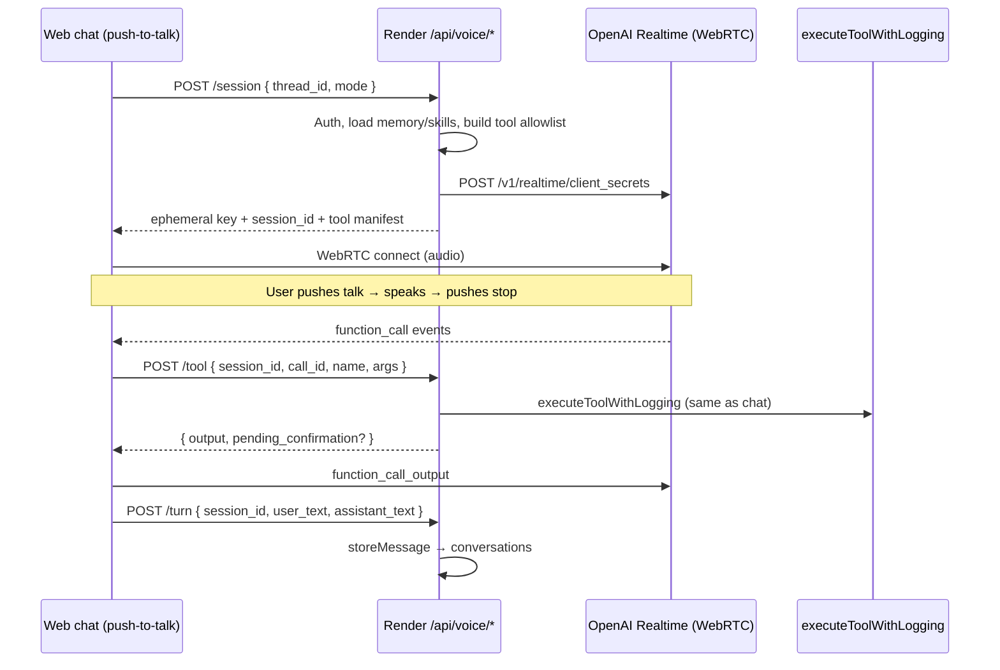

# Karna Voice (GPT Realtime 2) — Build Plan

**Status:** Planning → Phase 1 implementation  
**Date:** 2026-07-02  
**Model:** `gpt-realtime-2` (English, push-to-talk)  
**API key source:** `llm_slot_2` only (user-configured OpenAI key)

---

## Goals

Add a **realtime voice interaction layer** on top of the existing agent, memory, digests, and integrity stack — not a separate voice bot.

### In scope (this build)

| Feature | Description |
|---------|-------------|
| **Live Voice Session (web)** | Push-to-talk mic in chat; WebRTC to OpenAI Realtime; tools executed server-side |
| **Session modes** | `quick` (minimal reasoning, reminders/memory) · `work` (full tools) · `commute` (read-only + queued writes) |
| **Read-only phase** | Calendar, memory, Gmail list/read/search, schedules, digest summary |
| **Write phase** | Full tools with spoken + server confirmation gates |
| **Multimodal** | Screenshot/photo attach during voice session → grounded reply + optional R2 persist |
| **Commute mode** | Constrained tool allowlist; writes become pending confirmations in web/Telegram |

### Explicit constraints (user decisions)

| Decision | Choice |
|----------|--------|
| API key | **`llm_slot_2`** — dedicated voice slot; do not rotate slots 1/3 for Realtime |
| Language | **English only** (`language: en` in session; no translate model) |
| Input UX | **Push-to-talk** — tap once to start, tap again to stop (not hold-to-speak) |
| Transcript storage | **Text yes, audio no** (see § Transcript policy) |
| Runtime | **Render native** (`RENDER_RUN_NATIVE_APP=true`) — voice routes excluded from CF 8s proxy timeout |

---

## Transcript policy — do we need it?

**Yes for text. No for raw audio.**

| Store | Why |
|-------|-----|
| **User utterance text** (from Realtime input transcription) | Thread continuity; user can scroll chat history; memory/skill flywheel can fingerprint tool runs |
| **Assistant response text** (from output transcription or `response.done` text) | Audit trail; integrity verification (“what did Karna claim?”) |
| **Tool execution log** (existing `tool_execution_log`) | Already required for idempotency and policy gates — unchanged |
| **Raw audio blobs** | **Skip by default** — ephemeral, costly (R2), weak integrity value, privacy burden |

### When text is written

- After each **push-to-talk turn** ends (user stop → model finishes speaking): persist one `user` + one `assistant` row in `conversations` with `channel: 'voice'`.
- Metadata: `{ voice_mode, session_id, tools_used: [...] }` — no audio URLs.
- Screenshots: if user attaches image, store in R2 via existing upload path; reference `document_id` or URL in message metadata.

### What we skip

- Full session audio recording
- Word-level timestamps (unless needed later for debugging)
- Separate `voice_transcripts` table — reuse `conversations` + `threads`

---

## Architecture



### Why client WebRTC + server tools

- **Lowest audio latency** — browser ↔ OpenAI directly for media
- **Integrity preserved** — all mutations run on Render via existing `executeTool`
- **No WebSocket server on CF** — session minting can live on CF gateway; tool calls must hit Render (or CF with long timeout — prefer Render)

### Credential resolution

New helper `resolveOpenAiVoiceConfig(db, userId, pinHash)`:

1. Read **only** `credentials` row `service = 'llm_slot_2'`
2. Decrypt; require `provider === 'openai'` and non-empty `apiKey`
3. Model default: `gpt-realtime-2`; optional override via slot `model` field
4. Clear error if slot 2 missing or not OpenAI: *"Add an OpenAI key in Settings → Keys → Slot 2"*

---

## Session modes & tool allowlists

Tools are filtered **server-side** when minting the Realtime session — the client never sees disallowed tools.

### Mode: `quick`

- **Reasoning:** `minimal`
- **Tools:** `list_schedules`, `create_schedule`, `search_memory`, `list_reminders`, `snooze` equivalents via notifications API if exposed
- **Use case:** timers, reminders, memory recall

### Mode: `work` — Phase A (read-only)

- **Reasoning:** `low` (reads) · escalate to `medium` if parallel tools
- **Tools (read-only subset):**
  - Calendar: `list_calendar_events`
  - Gmail: `gmail_list`, `gmail_search`, `gmail_read`, `gmail_unread_count`
  - Sheets: `read_sheet`, `list_sheets` (if exists)
  - Memory: `search_memory`
  - Schedules: `list_schedules`
  - Digests: `get_latest_digest` (new thin wrapper over digest service)
  - Drive: `list_drive_files`, `search_drive_files`
  - Docs: `read_doc` (if exists)
  - **Tandem / UDM:** `udm_list_pages`, `udm_read_page`, `udm_search`, `udm_list_comments`, `udm_read_page_with_comments`, `udm_list_agent_comments`, `udm_read_database`

### Mode: `work` — Phase B (writes + confirmation)

- **Reasoning:** `medium` for writes; `high` for `browser_task`
- **All work read tools** plus write tools
- **Tandem / UDM writes (desktop, confirm_required):** `udm_write_page`, `udm_edit_section`, `udm_apply_comment`, `udm_create_page`, database row/property tools, etc.
- **Policy:** voice channel forces `transaction_mode: 'confirm_required'` on first call for `RISKY_WRITE_TOOLS`; server returns `pending_confirmation` payload; client prompts model to ask user verbally; on explicit yes, client re-submits with `transaction_mode: 'execute'`

### Mode: `commute`

- **Reasoning:** `minimal` / `low`
- **Tools:** read-only work set + `create_schedule` (reminders only)
- **Writes (email, sheet, calendar create):** server does **not** execute — inserts `voice_pending_actions` row; surfaces badge in web + optional Telegram message
- User confirms later in text UI: "Send draft email to X?" → one-tap confirm

---

## Voice system prompt

Reuse `buildSystemPrompt()` with `channel: 'voice'` and a **Voice Addendum** block:

```
## Voice channel
- English only. Short spoken sentences.
- Push-to-talk: user controls when the mic is open; do not ask them to hold a button.
- Preambles: only when a tool takes >2s ("Checking your calendar").
- Before any send/write/delete: speak the exact action and wait for "yes" / "go ahead".
- After tools complete: one short spoken result.
- Same anti-fabrication rules as text.
```

Map router intent → reasoning effort at session mint time (can update mid-session on mode change):

| Router agent | Reasoning effort |
|--------------|------------------|
| `conversation`, `memory`, `scheduler` | `minimal` / `low` |
| `workspace` (reads) | `low` |
| `multi`, `research`, browser | `medium` / `high` |

---

## Multimodal “Look at This”

1. During active voice session, user taps **attach** (camera icon) → file picker or paste
2. Client uploads via existing `POST /api/chat/upload` → R2 + metadata
3. Client sends image to Realtime session as `input_image` (base64 or URL per API)
4. On turn end, user message metadata includes `{ attachment_id, r2_key }`
5. If user asks to "save this", optionally `parse_document` / library ingest in background

---

## API routes (new `/api/voice`)

| Method | Route | Purpose |
|--------|-------|---------|
| `POST` | `/session` | Auth → mint ephemeral client secret + return `session_id`, `expires_at`, allowed tools |
| `POST` | `/tool` | Execute one Realtime function call; return output or `pending_confirmation` |
| `POST` | `/turn` | Persist text transcript for one PTT turn |
| `POST` | `/end` | End session; flush any pending state |
| `GET` | `/pending` | List commute-mode queued actions |
| `POST` | `/pending/:id/confirm` | Execute queued action with `transaction_mode: execute` |
| `POST` | `/pending/:id/cancel` | Discard queued action |

All routes: `Authorization: Bearer <sessionId>` (same as chat).

### Render / proxy

- Add `/api/voice` to long-timeout proxy list (or serve only on Render in Phase B)
- `RENDER_PROXY_TIMEOUT_MS_LONG` already 310s for chat — voice session mint is fast; tool calls may be slow

---

## Frontend (conversation mode)

### UX

1. Mic button in chat input pill (next to attach)
2. **Idle** → tap once → **Live** (listening, pulsing mic)
3. Speak naturally; server VAD ends your turn after ~700ms silence
4. Assistant replies (mic muted while speaking); mic re-opens automatically
5. Tap mic again (or say "goodbye") to end session
6. Optional image attach during session

### State machine

```
idle → connecting → listening ⇄ processing → speaking
         ↑ tap to start              ↑ tap or "goodbye" to end
```

### Implementation files

- `src/frontend/voice.ts` — WebRTC, session lifecycle, tool relay
- `src/frontend/chat.ts` — mic button, mode indicator
- `src/frontend/karna.css` — listening/speaking states

---

## Database changes

### Migration `0053_voice.sql` (minimal)

```sql
-- voice_pending_actions for commute mode
CREATE TABLE voice_pending_actions (
  id INTEGER PRIMARY KEY AUTOINCREMENT,
  user_id INTEGER NOT NULL,
  thread_id INTEGER,
  session_id TEXT,
  tool_name TEXT NOT NULL,
  tool_args TEXT NOT NULL,  -- JSON
  summary TEXT NOT NULL,    -- human-readable for confirm UI
  status TEXT DEFAULT 'pending',  -- pending | confirmed | cancelled | expired
  created_at TEXT DEFAULT CURRENT_TIMESTAMP,
  expires_at TEXT
);

-- threads.channel already supports text; extend app types to include 'voice'
-- conversations.channel: store 'voice' as text value (no schema change if TEXT)
```

No audio storage table.

---

## Integrity & confirmation flow

### Voice-specific defaults

```typescript
// When channel === 'voice' and tool in RISKY_WRITE_TOOLS:
// 1. First call without execute → return pending_confirmation + spoken summary
// 2. Client must get verbal "yes" from user
// 3. Retry with transaction_mode: 'execute'
```

### Commute mode

- Write tools never execute live
- `voice_pending_actions` + in-app notification
- Telegram optional: "Karna queued an email draft — confirm in app"

### Existing gates (unchanged)

- `enforcePolicyGate`, `validateToolContract`, idempotency window, `tool_execution_log`

---

## Phased delivery

### Phase 1.5 — Responsive voice UI ✅

- [x] Floating center 72px mic on mobile (`pointer: coarse` / max-width 640px)
- [x] Compact voice dock on desktop

### Phase 2 — Writes + confirmation ✅

- [x] Desktop Work mode `phase=full` with `confirm_required` on risky writes
- [x] Spoken yes/go ahead → retry with `transaction_mode=execute`

### Phase 2b — Operator + abort ✅

- [x] Operator mode (desktop only): browser_task, vault_lookup, browser_task_status
- [x] Abort button + `POST /api/voice/abort-browser` + `stopBrowserTask()`

### Phase 3 — Commute mode

- [ ] `voice_pending_actions` table + API
- [ ] Commute allowlist
- [ ] Confirm/cancel UI + optional Telegram nudge

### Phase 4 — Multimodal

- [ ] Image attach during voice session
- [ ] R2 persist + thread metadata

### Phase 5 — Polish

- [ ] Digest "brief me" shortcut (read stored digest aloud)
- [ ] Usage metering (voice minutes vs daily limit)
- [ ] Session reconnect / error recovery

---

## Risks & mitigations

| Risk | Mitigation |
|------|------------|
| Slot 2 not OpenAI | Clear settings error; validate on session create |
| Render cold start drops WebRTC | Document; optional keep-warm ping |
| Client-side tool bypass | Tools not in session config = not callable; server re-validates on `/tool` |
| Accidental sends | Voice defaults to `confirm_required` for risky tools |
| Cost | Track session duration; optional daily voice cap |
| `search_library` on Render | CF proxy for Vectorize or degrade gracefully in voice mode |

---

## Open items (deferred)

- Wake word / always-on listening
- SIP / phone calling
- TTS for Telegram replies
- Non-English (`gpt-realtime-translate`)

---

## Testing checklist

- [ ] Session create with valid slot 2 OpenAI key
- [ ] Session create fails without slot 2
- [ ] Read-only tool: `list_calendar_events` round-trip
- [ ] Write tool blocked without confirmation in voice mode
- [ ] PTT turn persisted to thread as text
- [ ] Commute mode queues write without executing
- [ ] Image attach visible in thread metadata
